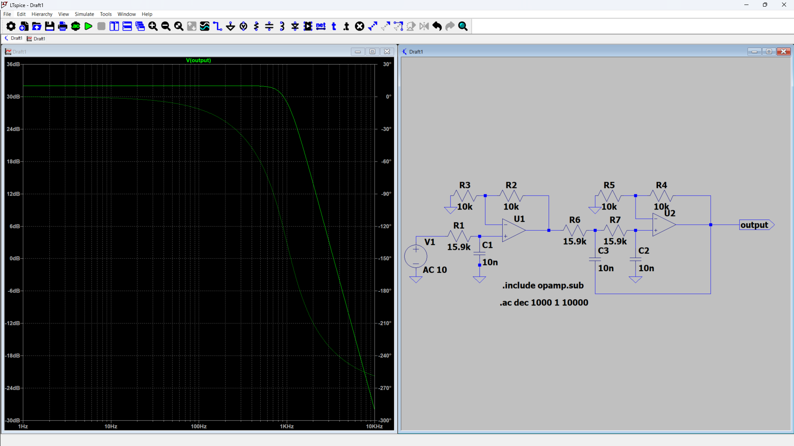

# Butterworth Low-Pass Filter Design Using Python and LTspice

## Project Goal

Design a 3rd-order Butterworth low-pass filter from specifications using Python, calculate the required component values, implement the circuit in LTspice using a Sallen-Key topology, and verify the response through simulation.

---

# Design Specifications

```python
Ap = 3      # Passband attenuation (dB)
As = 40     # Stopband attenuation (dB)

Wp = 2*np.pi*1000    # 1 kHz
Ws = 2*np.pi*5000    # 5 kHz
```

---

# Step 1: Determine Filter Order

```python
import numpy as np
from scipy import signal

Ap = 3
As = 40

Wp = 2*np.pi*1000
Ws = 2*np.pi*5000

n, wn = signal.buttord(
    Wp,
    Ws,
    Ap,
    As,
    analog=True
)

print("Order =", n)
print("Cutoff Frequency =", wn/(2*np.pi), "Hz")
```

Output:

```text
Order = 3
Cutoff Frequency ≈ 1000 Hz
```

---

# Step 2: Generate Transfer Function

```python
b, a = signal.butter(
    n,
    wn,
    analog=True
)

print("Numerator:")
print(b)

print("Denominator:")
print(a)
```

Output:

```text
H(s)=
2.486e11
--------------------------------------
s³+1.258e4s²+7.908e7s+2.486e11
```


---

# Step 3: Determine Sallen-Key Section

A third-order Butterworth filter can be written as:

$ (s^2+\omega_cs+\omega_c^2)$

Thus:

* First-order RC section
* Second-order Sallen-Key section

---

# Step 4: Calculate Components

Choose:

```python
C = 10e-9
fc = 1000

R = 1/(2*np.pi*fc*C)

print(R)
```

Output:

```text
15915 Ω
```

Use standard values:

```text
R = 15.9 kΩ
C = 10 nF
```

---

# Final Component Values

## First-Order RC

| Component | Value    |
| --------- | -------- |
| R0        | 15.9 kΩ |
| C0        | 10 nF    |

---

## Second-Order Sallen-Key

| Component | Value    |
| --------- | -------- |
| R1        | 15.9 kΩ |
| R2        | 15.9 kΩ |
| C1        | 10 nF    |
| C2        | 10 nF    |
| Rf        | 10 kΩ   |
| Rg        | 10 kΩ   |

Op-Amp Gain:

$K=1+\frac{R_f}{R_g}=2K = 1+\frac{R_f}{R_g}=2$ ---

# LTspice Implementation

## Power Supplies

```spice
VCC V+ 0 DC 12
VEE V- 0 DC -12
```

---

## AC Input Source

```spice
Vin IN 0 AC 1
```

---

## Simulation Directive

```spice
.ac dec 100 10 100k
```

---

# LTspice Schematic

## First-Order Section

```text
Vin ── R0 ──┬── Node1
            │
           C0
            │
           GND
```

---

## Second-Order Sallen-Key

```text
Node1 ── R1 ──┬──── R2 ─── Output
              │
             C1
              │
             GND

Output ── C2 ── GND
```

The op-amp is configured as a non-inverting amplifier:

```text
Rf = 10 kΩ
Rg = 10 kΩ
Gain = 2
```

---

# Expected Results

## Cutoff Frequency

```text
fc ≈ 1 kHz
```

## Gain at Cutoff

```text
−3 dB
```

## Roll-Off

```text
−60 dB/decade
```

## Stopband Attenuation

```text
> 40 dB at 5 kHz
```

---

# Verification

Compare:

### Python

```python
signal.bode(...)
```

with

### LTspice

```spice
.ac dec 1000 1 10k
```

The magnitude and phase responses should closely match, validating both the mathematical design and the circuit implementation.

---

# Technologies Used

* Python
* NumPy
* SciPy
* Matplotlib
* SymPy
* LTspice

---

# Learning Outcomes

* Butterworth approximation
* Analog filter synthesis
* Transfer functions
* Pole analysis
* Sallen-Key design
* LTspice simulation
* Verification of theoretical and practical results
