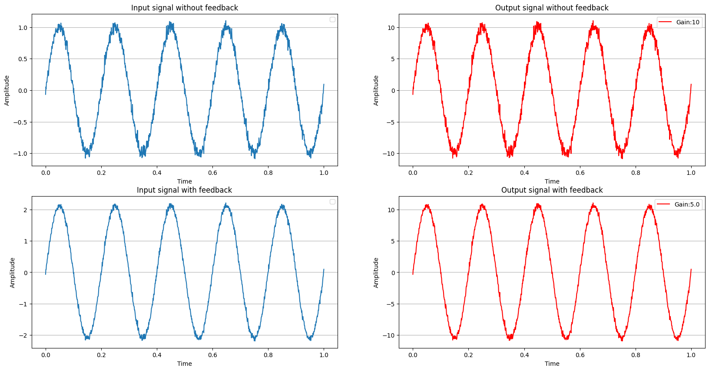

# Negative Feedback in Analogue Electronics

This notebook demonstrates the concept of **negative feedback** in amplifier circuits and its effects on signal amplification and noise reduction.



## Overview

Negative feedback is a fundamental concept in analogue electronics where a portion of the output signal is fed back to the input in an inverted (180°) phase. This technique is widely used to improve amplifier performance.

## Key Concepts

### 1. Gain with Negative Feedback

The closed-loop gain (gain with feedback) is given by:

```
Gain_f = Gain / (1 + Gain × Feedback_Factor)
```

Where:

- `Gain_f` = Gain with feedback
- `Gain` = Open-loop gain (without feedback)
- `Feedback_Factor` = Feedback factor (H)

### 2. Noise Reduction

One of the major benefits of negative feedback is noise reduction. The noise contributed by the amplifier is reduced by the feedback factor:

```
Output_Noise_with_FB = Output_Noise_without_FB / (1 + Gain × Feedback_Factor)
```

## Demonstration

The notebook includes Python simulations showing:

- Input signal vs amplified output
- Effect of noise on the signal
- Signal improvement when negative feedback is applied


## Key Benefits of Negative Feedback

1. **Reduces Noise** - Amplifier noise is attenuated by the feedback factor
2. **Improves Bandwidth** - Extends the frequency response of the amplifier
3. **Reduces Distortion** - Minimizes non-linear distortion
4. **Increases Stability** - Makes the circuit more predictable and stable
5. **Controls Gain** - Allows precise control of the amplification factor

## Parameters Used

- **G (Open-loop Gain)**: 10
- **H (Feedback Factor)**: 0.9

## Formula

The output with negative feedback is calculated as:

```
y_feedback = (G/(1+G*H))*x + noise/(1+G*H)
```

Where `x` is the input signal and `noise` is the amplifier noise.
